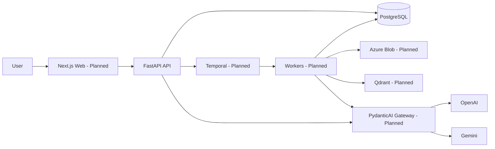
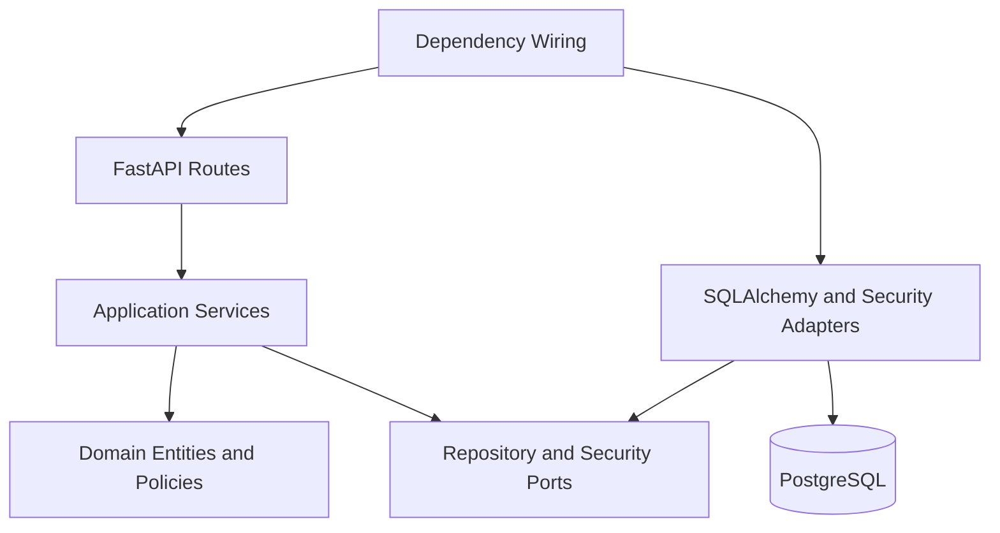

# Architecture

## Architectural Style

The system is a modular monolith with separately deployable web, API, and Temporal worker processes. Domain boundaries are enforced inside the backend before any domain is considered for service extraction.

Core rules:

- Domain and application layers depend inward only.
- Infrastructure implements ports defined by application/domain layers.
- PostgreSQL is the transactional source of truth.
- External stores and workflow projections are rebuildable or reconcilable.
- Every tenant-owned operation is scoped by `organization_id`.

## System Architecture



## Backend Component Diagram



Implemented backend paths:

```text
backend/src/knowledge_os/
  api/              FastAPI delivery and schemas
  application/      Use-case orchestration and ports
  domain/           Entities, errors, repository contracts
  infrastructure/   SQLAlchemy, security, and database adapters
```

## Runtime Architecture

| Runtime | Responsibility | Status |
|---|---|---|
| FastAPI API | Synchronous commands/queries, auth, streaming entry point | Implemented partially |
| Next.js web | User interface and browser state | Planned |
| Temporal ingestion worker | Document extraction, chunking, embeddings, indexing | Planned |
| Temporal agent worker | Agent and report execution | Planned |
| PostgreSQL | Business truth and product-facing projections | Implemented partially |
| Qdrant | Derived vector index | Planned |
| Azure Blob | Immutable binaries and generated artifacts | Planned |
| PydanticAI gateway | Provider-neutral model and agent execution | Planned |

## Deployment Architecture

Planned Kubernetes deployments:

- `web`
- `api`
- `worker-ingestion`
- `worker-agent`
- `otel-collector`

Managed PostgreSQL, Blob Storage, Qdrant, and Temporal are preferred. API and workers are stateless and scale horizontally. Task queues isolate ingestion, embedding, agent, and report workloads.

## Request Data Flow

Implemented project command:

```text
HTTP request
  -> FastAPI/Pydantic validation
  -> bearer identity dependency
  -> application service
  -> unit of work
  -> tenant-scoped repository
  -> PostgreSQL transaction
  -> response schema
```

Planned asynchronous command:

```text
HTTP command
  -> PostgreSQL state + outbox event
  -> workflow starter
  -> Temporal workflow
  -> idempotent activities
  -> PostgreSQL progress/result projection
```

## Related Decisions

- `docs/adr/ADR-001-modular-monolith.md`
- `docs/adr/ADR-002-temporal.md`
- `docs/adr/ADR-003-postgresql-source-of-truth.md`
- `docs/adr/ADR-004-qdrant-derived-store.md`
- `docs/adr/ADR-005-pydanticai.md`

