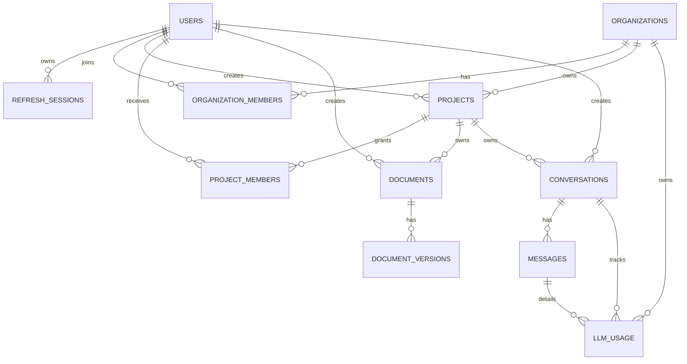

# Database Map

## Principles

- PostgreSQL is the authoritative transactional store.
- Every tenant-owned row includes `organization_id`.
- Qdrant and workflow projections are derived or reconcilable.
- Foreign keys and constraints enforce invariants where practical.
- Migrations are forward-only in production and follow expand/migrate/contract.

## Implemented Entity Overview



## Implemented Tables

| Table | Responsibility | Ownership |
|---|---|---|
| `users` | Identity, normalized email, password hash, status | Global identity |
| `refresh_sessions` | Hashed refresh tokens, rotation family, revocation | User |
| `organizations` | Mandatory tenant root | Organization |
| `organization_members` | User-to-tenant roles | Organization |
| `projects` | Project metadata, soft deletion, optimistic version | Organization |
| `project_members` | User-to-project roles | Organization and project |
| `documents` | Logical document metadata, soft deletion | Organization and project |
| `document_versions` | Immutable document versions, blob references, status | Organization and document |
| `conversations` | Conversation metadata, soft deletion | Organization and project |
| `messages` | Chat history messages, role, content, metadata | Conversation |
| `llm_usage` | Token counts, costs, and latency details for AI interactions | Organization, conversation, and message |

Critical integrity rules:

- Email and organization slug are unique.
- Organization membership is unique per user/organization.
- Project membership is unique per user/project.
- Composite project membership foreign key prevents cross-tenant project references.
- `projects.version` is positive and used for atomic optimistic locking.
- Soft-deleted projects are excluded from normal reads.

## Planned Tables

| Domain | Tables |
|---|---|
| Knowledge | `chunks`, `knowledge_entries`, `index_manifests` |
| Conversations | `message_citations` |
| Agents | `agent_runs`, `agent_run_steps` |
| Reports | `reports` |
| Workflows | `workflow_runs`, `outbox_events` |
| Platform | `idempotency_keys`, `audit_events`, `feedback` |

## Ownership Rules

1. Repository methods require tenant/user context where applicable.
2. Cross-tenant resource lookup returns `404`.
3. A domain writes only its owned tables.
4. Cross-domain reads use public query interfaces, not direct repository imports.
5. Blob and Qdrant identifiers include tenant/project scope.

## Data Flow

Implemented write:

```text
Application service -> UnitOfWork -> repository adapter -> PostgreSQL transaction
```

Planned indexed document:

```text
Blob binary -> extraction -> PostgreSQL chunks -> embeddings -> Qdrant points
```

PostgreSQL chunks remain authoritative; Qdrant can be rebuilt.

## Migration Rules

- Use Alembic only.
- Review generated migrations manually.
- Never combine unbounded backfills with schema DDL.
- Add structures before requiring them; remove old structures in a later release.
- Validate with `make migration-sql`.

