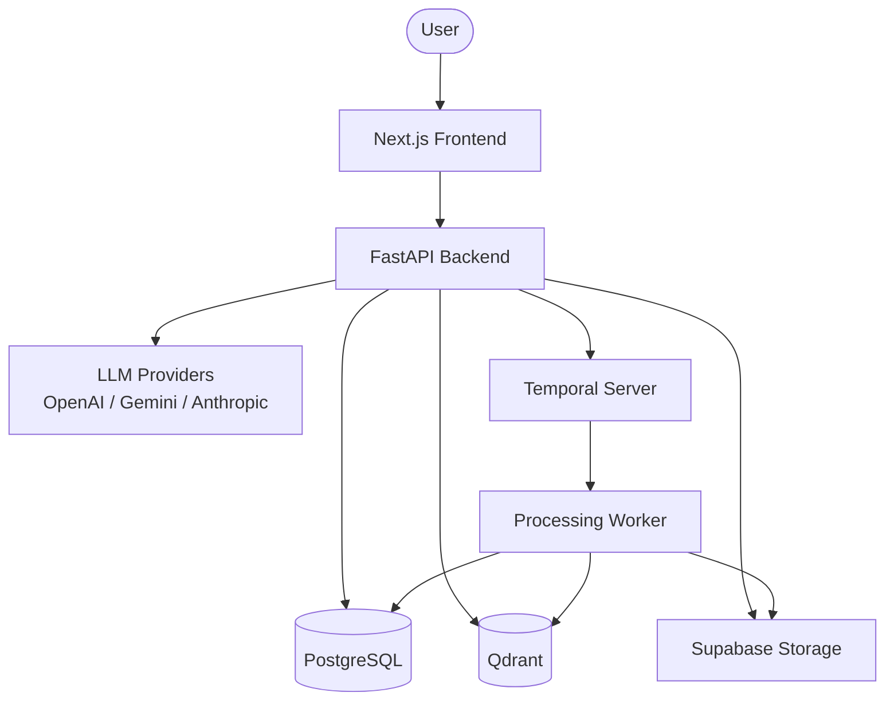

<p align="center">
  
  
  
  
</p>

<h1 align="center">Knowledge OS</h1>

<p align="center">
  <strong>AI-first, project-centric knowledge platform for documents, conversations,<br>retrieval, and durable workflows.</strong>
</p>

<p align="center">
  <a href="#features">Features</a> ·
  <a href="#architecture">Architecture</a> ·
  <a href="#getting-started">Getting Started</a> ·
  <a href="#deployment">Deployment</a> ·
  <a href="#development">Development</a> ·
  <a href="#license">License</a>
</p>

---

## Overview

Knowledge OS is a full-stack RAG (Retrieval-Augmented Generation) platform that lets you upload documents, automatically process and index them, and chat with an AI that grounded its responses in your actual content — complete with source citations.

Built with Clean Architecture principles, multi-tenancy from day one, and a modular monolith backend designed for future decomposition.

**Tech Stack:** FastAPI · Next.js · PostgreSQL · Qdrant · Temporal · Supabase Storage

---

## Features

| Feature | Description |
|---------|-------------|
| **Multi-tenant Auth** | JWT + Argon2 password hashing, refresh token rotation, Google OAuth |
| **Project Workspaces** | Organize documents and conversations per project with role-based access |
| **Document Management** | Upload, version, delete documents with automatic status tracking |
| **Document Processing** | Extract text → chunk → embed → index pipeline with Temporal or sync mode |
| **RAG Chat** | AI responses grounded in your documents with inline source citations |
| **PDF Viewer** | In-app PDF viewer with citation overlay, slides in from the right |
| **Message Feedback** | Thumbs up/down on assistant responses for quality tracking |
| **Dashboard** | Project list with document and conversation stats |
| **Dual Processing** | Switch between Temporal workflow (async) and synchronous processing via env var |

---

## Architecture

### System Diagram



### Tech Stack

| Layer | Technology |
|-------|-----------|
| **Frontend** | Next.js 16, React 19, Tailwind CSS 4, Zustand, TanStack Query |
| **Backend** | FastAPI, Python 3.13, SQLAlchemy Async, Alembic |
| **Database** | PostgreSQL (system of record) |
| **Vector Store** | Qdrant (derived, rebuildable) |
| **Object Storage** | Supabase Storage (S3-compatible) |
| **Workflows** | Temporal (or synchronous fallback) |
| **AI / Embeddings** | OpenAI, Google Gemini, Anthropic |
| **Auth** | JWT + Argon2 (pwdlib), Google OAuth |
| **Deployment** | Render (backend), Vercel (frontend), Docker Compose (local) |
| **Dev Tools** | uv, Ruff, mypy (strict), pytest |

### Processing Pipeline

```
Upload Document
      │
      ▼
┌─────────────┐    ┌─────────────┐    ┌─────────────┐
│  Extract    │───▶│   Chunk     │───▶│   Embed     │
│  Text       │    │  (500 tok)  │    │  & Index    │
└─────────────┘    └─────────────┘    └─────────────┘
      │                  │                   │
      ▼                  ▼                   ▼
  Storage            PostgreSQL            Qdrant
```

---

## Project Structure

```
├── backend/                  FastAPI modular monolith
│   ├── src/knowledge_os/
│   │   ├── api/              HTTP routes, schemas, dependencies
│   │   ├── application/      Business logic, services, ports
│   │   ├── domain/           Entities, repositories, value objects
│   │   └── infrastructure/   Database, storage, AI, vector store
│   ├── migrations/           Alembic database migrations
│   └── tests/                Pytest test suite
│
├── frontend/                 Next.js 16 application
│   └── src/
│       ├── app/              Route-based pages
│       ├── shared/           Types, API client, UI components, store
│       └── ...
│
├── docs/                     Technical spec and ADRs
│   ├── technical-specification.md
│   └── adr/                  Architecture Decision Records
│
├── .ai/                      AI agent context and rules
├── docker-compose.yml        Local infrastructure (Qdrant, Temporal)
└── render.yaml               Render deployment config
```

---

## Getting Started

### Prerequisites

- [uv](https://docs.astral.sh/uv/) (Python package manager)
- Python 3.13
- Node.js 18+
- Docker (for local infrastructure)

### Quick Start

**1. Clone the repository**

```bash
git clone https://github.com/nahyan0077/knowledge-os.git
cd knowledge-os
```

**2. Start local infrastructure**

```bash
docker compose up -d
```

This starts Qdrant (vector DB) and Temporal (workflow engine).

**3. Set up the backend**

```bash
cd backend
cp .env.example .env
# Edit .env with your database URL, API keys, etc.
make setup
make run
```

Backend runs at `http://localhost:8000`. API docs at `http://localhost:8000/docs`.

**4. Set up the frontend**

```bash
cd frontend
npm install
npm run dev
```

Frontend runs at `http://localhost:3000`.

**5. Create an account**

Open `http://localhost:3000`, sign up, create a project, and upload your first document.

---

## Environment Variables

### Backend (`KNOWLEDGE_OS_*`)

| Variable | Default | Description |
|----------|---------|-------------|
| `DATABASE_URL` | `postgresql+asyncpg://...localhost` | PostgreSQL connection string |
| `JWT_SECRET` | (must set) | Secret key for JWT signing (min 32 chars) |
| `CORS_ORIGINS` | `["http://localhost:3000"]` | Allowed CORS origins |
| `ACCESS_TOKEN_TTL_MINUTES` | `15` | Access token expiry |
| `REFRESH_TOKEN_TTL_DAYS` | `30` | Refresh token expiry |
| `SECURE_COOKIES` | `false` | Set to `true` in production |
| `STORAGE_PROVIDER` | `local` | `local`, `supabase`, or `azure_blob` |
| `SUPABASE_URL` | — | Supabase project URL |
| `SUPABASE_S3_ENDPOINT` | — | Supabase S3-compatible endpoint |
| `SUPABASE_REGION` | — | Supabase region |
| `SUPABASE_KEY` | — | S3 access key ID |
| `SUPABASE_SECRET_KEY` | — | S3 secret access key |
| `SUPABASE_STORAGE_BUCKET` | `documents` | Storage bucket name |
| `EMBEDDING_PROVIDER` | `openai` | `openai` or `gemini` |
| `OPENAI_API_KEY` | — | OpenAI API key |
| `GEMINI_API_KEY` | — | Google Gemini API key |
| `QDRANT_URL` | `http://localhost:6333` | Qdrant instance URL |
| `QDRANT_API_KEY` | — | Qdrant API key (if using Qdrant Cloud) |
| `TEMPORAL_HOST` | `localhost:7233` | Temporal server address |
| `TEMPORAL_NAMESPACE` | `default` | Temporal namespace |
| `TEMPORAL_API_KEY` | — | Temporal Cloud API key |
| `PROCESSING_MODE` | `temporal` | `temporal` or `sync` |

### Frontend (`NEXT_PUBLIC_*`)

| Variable | Description |
|----------|-------------|
| `NEXT_PUBLIC_API_URL` | Backend API URL (e.g. `https://knowledge-os-backend.onrender.com`) |

---

## Deployment

### Option 1: Docker Compose (Full Stack)

```bash
docker compose up -d --build
```

| Service | Port | URL |
|---------|------|-----|
| Backend API | 8000 | `http://localhost:8000/docs` |
| Frontend | 3000 | `http://localhost:3000` |
| Qdrant | 6333 | `http://localhost:6333/dashboard` |
| Temporal | 7233 | — |
| Temporal UI | 8080 | `http://localhost:8080` |

### Option 2: Render + Vercel

**Backend (Render):**

1. Push to GitHub
2. Go to [render.com](https://render.com) → **New** → **Blueprint**
3. Connect your repo — Render reads `render.yaml` automatically
4. Set required env vars in the Render dashboard (see table above)
5. Deploy

**Frontend (Vercel):**

```bash
cd frontend
npx vercel --prod
```

Set `NEXT_PUBLIC_API_URL` to your Render backend URL.

### Option 3: Sync Mode (No Temporal Required)

After the Temporal free trial expires, switch to synchronous processing:

1. Set `KNOWLEDGE_OS_PROCESSING_MODE=sync` on Render
2. Remove the worker service (if any)
3. Deploy

Documents will process inline during upload (5-30 seconds). All other features remain the same.

---

## Development

### Commands

```bash
make help           # Show all available commands
make setup          # Install all dependencies
make run            # Start backend dev server
make test           # Run test suite
make check          # Lint + typecheck
make migrate        # Run database migrations
make migration-sql  # Generate migration SQL
```

### Frontend Commands

```bash
cd frontend
npm run dev         # Start dev server
npm run build       # Build for production
```

> **Note:** Frontend build requires `--webpack` flag on Apple Silicon: `npm run build -- --webpack`

### Code Quality

- **Linting:** Ruff (line-length 100, Python 3.13 target)
- **Type checking:** mypy (strict mode)
- **Testing:** pytest with async support
- **Frontend:** ESLint

Run all checks before committing:

```bash
make check
```

---

## Architecture Decisions

| ADR | Decision | Status |
|-----|----------|--------|
| [ADR-001](docs/adr/ADR-001-modular-monolith.md) | Modular Monolith | Accepted |
| [ADR-002](docs/adr/ADR-002-temporal.md) | Temporal for Durable Workflows | Accepted |
| [ADR-003](docs/adr/ADR-003-postgresql-source-of-truth.md) | PostgreSQL as Source of Truth | Accepted |
| [ADR-004](docs/adr/ADR-004-qdrant-derived-store.md) | Qdrant as Derived Vector Store | Accepted |
| [ADR-005](docs/adr/ADR-005-pydanticai.md) | PydanticAI Behind Provider-Neutral Ports | Accepted |
| [ADR-006](docs/adr/ADR-006-project-centric-hierarchy.md) | Project-Centric Hierarchy | Accepted |

---

## Contributing

1. Read [.ai/PROJECT_CONTEXT.md](.ai/PROJECT_CONTEXT.md) for project overview
2. Follow [.ai/CODING_STANDARDS.md](.ai/CODING_STANDARDS.md) for code style
3. Check [docs/adr](docs/adr) before changing architecture
4. Run `make check` before committing
5. Add tests proportional to your changes

---

## License

This project is licensed under the MIT License — see the [LICENSE](LICENSE) file for details.

---

<p align="center">
  Built with care by <a href="https://github.com/nahyan0077">Nahyan</a>
</p>
