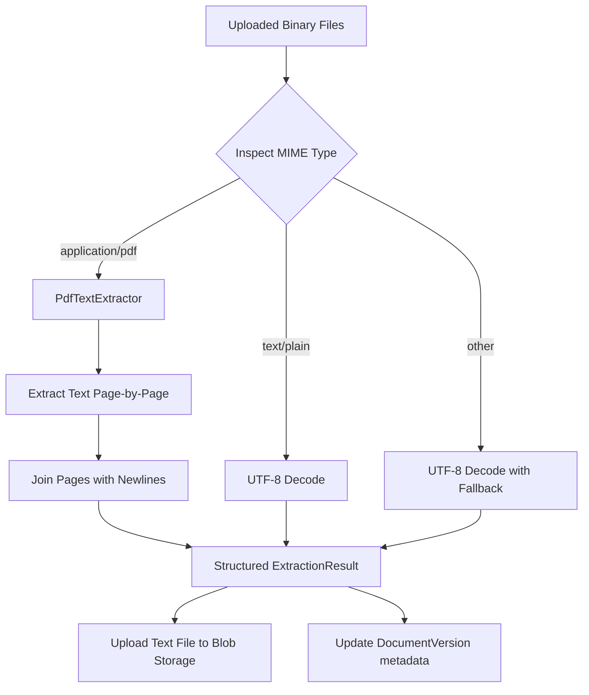

# Ingestion & Chunking Strategy

This document details the text extraction, tokenization, and character chunking strategy used in the ingestion pipeline.

---

## 1. Document Extraction Pipeline

The extraction pipeline transforms raw uploaded binary files into normalized plain text while gathering structure metrics (character and page counts).

### Components
1. **PdfTextExtractor**:
   - Uses `pypdf` library to process PDF streams.
   - Extracts page-by-page, preserving page ordering.
   - Gracefully handles empty pages by inserting empty strings to keep relative page count tracking accurate.
   - Malformed PDFs are caught safely, logging the error and returning an empty string with `page_count = 0` and `extracted_characters = 0` to prevent ingestion pipeline crashes.
2. **Metadata Capture**:
   - The extraction layer returns an `ExtractionResult` structure containing:
     - `text`: Concatenated plain text.
     - `page_count`: Total parsed page count (or `None` for non-paged formats).
     - `extracted_characters`: Length of the final text string.
   - These parameters are persisted directly to the corresponding `DocumentVersion` record in PostgreSQL (`extracted_characters` and `page_count`).

---

## 2. Token Counting Strategy

To guarantee that chunks fit within target model contexts during vector indexing and LLM prompt framing, real tokenization is executed.

### Tiktoken Integration
- **Library**: `tiktoken` (standard BPE tokenizer used by OpenAI/Gemini models).
- **Default Model**: `text-embedding-3-small` (which uses the `cl100k_base` encoding family).
- **Configurability**: The `TokenCounter` service accepts a `model_name` at construction to retrieve the appropriate encoding, falling back to `cl100k_base` for unknown models.
- **Accuracy**: Replacing simple space-based token approximations (`len(content.split())`) with actual encoding lengths ensures highly accurate constraints for vector databases and LLMs.

---

## 3. Chunk Metadata Model

After plain text is uploaded to blob storage, the `TextChunker` slices the text using a character-based sliding-window algorithm that respects word boundaries:

1. **Sliding Window**: Extracts slices of `chunk_size` (e.g. 500 characters) with a predefined `chunk_overlap` (e.g. 100 characters).
2. **Word Boundary Alignment**: Adjusts the slicing point backward using `rfind(" ")` within a suffix window of `50` characters.
3. **Metrics Generation**:
   - For each generated chunk, the pipeline calculates:
     - `char_count`: Exact length of the chunk content (`len(content)`).
     - `token_count`: Accurate model-aware token count via `TokenCounter`.
   - These properties are stored in the `DocumentChunk` domain entity and persisted in the `document_chunks` table in PostgreSQL.

### Database Schema Projections
- **`document_versions`**:
  - `extracted_characters`: `Integer` (null for unextracted).
  - `page_count`: `Integer` (null for non-paged documents).
- **`document_chunks`**:
  - `token_count`: `Integer`.
  - `char_count`: `Integer`.
