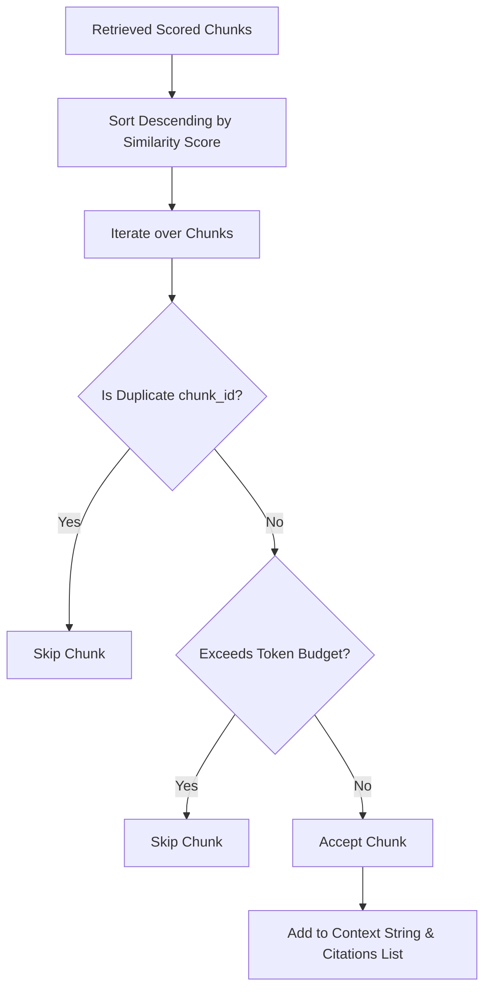

# Context Builder

The `ContextBuilder` is responsible for selecting, deduplicating, and formatting retrieved document chunks into a coherent text payload suitable for LLM consumption, while strictly respecting a token budget.

## Responsibilities

1. **Relevance Selection**: Prioritize chunks based on their vector search similarity score (descending order).
2. **Deduplication**: Filter out duplicate chunks matching on `chunk_id` to ensure unique content density within the context budget.
3. **Token Budget Enforcement**: Accumulate the token size of chunks (using the authoritative `token_count` calculated by `tiktoken` during ingestion) and prune any chunks that would exceed the configured token limit.
4. **Context Formatting**: Convert the selected chunks into a structured markdown block, including the source document version identifier and chunk index to help the LLM contextualize the text.
5. **Citation Mapping**: Extract a list of `Citation` domain objects corresponding to the selected chunks to maintain exact provenance.

## Pipeline Architecture



## Context Formatting Format

Each selected chunk is formatted as follows:

```text
Source Document Version: <version_id> (Chunk: <chunk_number>)
<chunk content>
---
```

This format guides the LLM to recognize document version boundaries and reference them.

## Configuration

* **Default Token Budget**: 4,000 tokens.
* **Overriding**: Configurable per RAG request by specifying the `token_budget` in the service interface.
