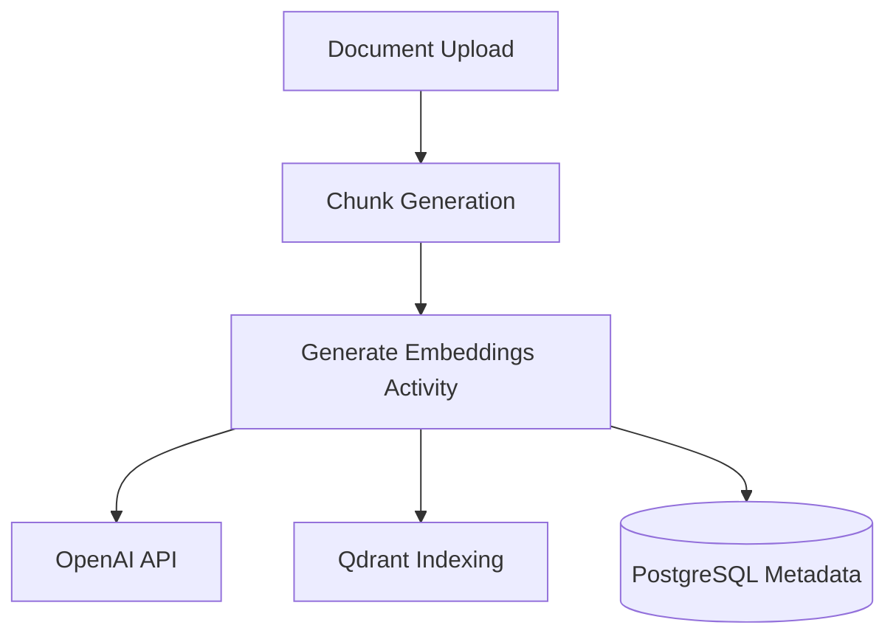

# Embedding and Vector Index Architecture

This document describes the architectural design, lifecycle, versioning strategy, and tenant isolation implementation for document chunk embeddings and the vector database infrastructure in Knowledge OS.

## 1. System Overview

Sprint 7 introduces support for generating chunk embeddings and indexing them into a high-performance vector store (Qdrant) as part of the document ingestion pipeline. This architecture is designed to support future retrieval workflows (RAG) while keeping retrieval separated from ingestion at this stage.



## 2. Ingestion & Embedding Lifecycle

The ingestion process is orchestrated by a Temporal workflow ([DocumentProcessingWorkflow](file:///Users/nahyanm/Documents/NAHYAN/projects/rag/backend/src/knowledge_os/application/workflows/document.py)). The embedding and indexing step is isolated inside a dedicated activity running on the `embedding-processing` queue:

1. **Load Chunks**: The [generate_chunk_embeddings](file:///Users/nahyanm/Documents/NAHYAN/projects/rag/backend/src/knowledge_os/infrastructure/workflows/activities.py#L320) activity retrieves the list of document chunks for a specific version from PostgreSQL.
2. **Generate Embeddings**: Chunks are processed in batches using the [OpenAIEmbeddingProvider](file:///Users/nahyanm/Documents/NAHYAN/projects/rag/backend/src/knowledge_os/infrastructure/ai/embeddings.py) (defaulting to the `text-embedding-3-small` model).
3. **Upsert to Qdrant**: The generated vector representations, along with tenant metadata, are upserted into Qdrant using the [QdrantVectorStore](file:///Users/nahyanm/Documents/NAHYAN/projects/rag/backend/src/knowledge_os/infrastructure/search/qdrant.py) adapter.
4. **Persist Metadata**: Embedding metadata (provider, model, dimension, version, and point IDs) is stored in the PostgreSQL database (`chunk_embeddings` table) via the `ChunkEmbeddingRepository`.

### Idempotency & Retry Safety
To ensure that ingestion retries or workflow resumes do not lead to duplicate data:
- **Qdrant Vector Purge**: Before upserting new vectors, the activity calls `delete_chunks_by_version` to purge any existing points associated with the `document_version_id` in Qdrant.
- **Metadata Re-creation**: In PostgreSQL, the repository deletes any existing embedding records matching the combination of `version_id` and the provider's `embedding_version` before adding new records.

---

## 3. Embedding Versioning Strategy

To support changing models or upgrading indexing strategies (e.g. migrating from 1536-dimensional `text-embedding-3-small` to 3072-dimensional `text-embedding-3-large`), the platform tracks versions at two layers:

1. **Schema and Code Versioning**: Each embedding provider defines an integer version (`embedding_version`).
2. **Database Tracking**: The `chunk_embeddings` table enforces a unique constraint on `(document_chunk_id, embedding_version)`. This allows multiple versions of embeddings to co-exist for the same document chunks during migration phases:
   - When a model update is rolled out, new embeddings are generated and appended alongside existing ones.
   - Older versions can be kept until they are decommissioned.
   - Retrieval queries can specify which embedding version/model version to target.

---

## 4. Qdrant Indexing Model

Vectors are indexed inside Qdrant in a single collection named `document_chunks`.

### Distance Metric
The collection is configured to use **Cosine Distance** (`Distance.COSINE`), which matches standard OpenAI and industry recommendations for text embedding similarity search.

### Vector Points Structure
Each point in Qdrant maps 1-to-1 with a `DocumentChunk` ID in PostgreSQL:
- **ID**: The UUID of the `DocumentChunk` is used as the Qdrant Point UUID (`qdrant_point_id`).
- **Vector**: The floating-point array representing the text chunk embedding.
- **Payload**: Metadata used for filtering and tenant isolation:
  ```json
  {
    "chunk_id": "uuid-string",
    "organization_id": "uuid-string",
    "project_id": "uuid-string",
    "document_version_id": "uuid-string"
  }
  ```

---

## 5. Tenant Isolation Strategy

Tenant isolation is non-negotiable. To ensure data privacy:

> [!IMPORTANT]
> Since a single Qdrant collection (`document_chunks`) is shared across all tenants, all query operations must enforce tenant-scoped filtering.

- **Storage**: All point payloads in Qdrant include `organization_id` and `project_id`.
- **Retrieval Filter (Future)**: Any search queries executed against Qdrant must specify payload matching filters:
  ```python
  from qdrant_client.http import models as rest_models

  tenant_filter = rest_models.Filter(
      must=[
          rest_models.FieldCondition(
              key="organization_id",
              match=rest_models.MatchValue(value=str(current_org_id)),
          ),
          rest_models.FieldCondition(
              key="project_id",
              match=rest_models.MatchValue(value=str(current_project_id)),
          ),
      ]
  )
  ```
  This ensures that under no circumstances can one tenant's queries return vector matches belonging to another tenant.
