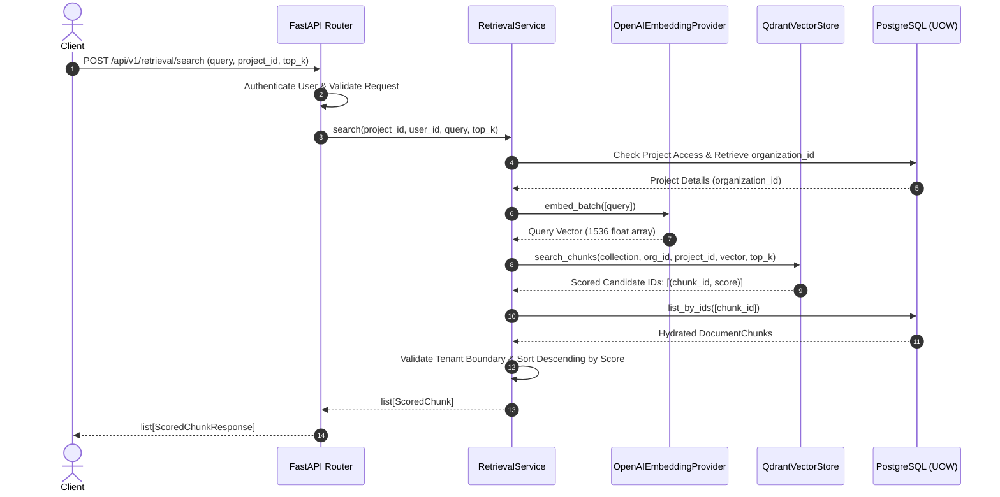

# Retrieval Architecture

This document describes the architectural design, query flows, hydration strategies, scoring models, and tenant isolation implementation for vector retrieval in Knowledge OS.

## 1. Overview

Sprint 8 introduces the Retrieval infrastructure, permitting semantic search over generated document chunks. Under no circumstances does the retrieval system generate answers or synthesize text (no RAG/generation). Its sole responsibility is finding, ranking, and returning candidate document chunks with their metadata.

---

## 2. Retrieval Search Flow

The retrieval process follows a linear execution path starting from a client query to candidate chunk retrieval:



### Flow Steps:
1. **Request Validation**: The FastAPI router validates the query payload and retrieves the user identity context.
2. **Project Authorization**: The [RetrievalService](file:///Users/nahyanm/Documents/NAHYAN/projects/rag/backend/src/knowledge_os/application/retrieval.py) verifies the user has access to the project by querying the PostgreSQL database. This step also fetches the tenant `organization_id` associated with the project.
3. **Query Embedding**: The query text is sent to the [OpenAIEmbeddingProvider](file:///Users/nahyanm/Documents/NAHYAN/projects/rag/backend/src/knowledge_os/infrastructure/ai/embeddings.py) to generate a 1536-dimensional semantic representation.
4. **Vector Search**: The query vector is passed to the [QdrantVectorStore](file:///Users/nahyanm/Documents/NAHYAN/projects/rag/backend/src/knowledge_os/infrastructure/search/qdrant.py) adapter. Qdrant filters points by tenant properties (`organization_id`, `project_id`) and computes similarity scores using Cosine distance.
5. **Database Hydration**: Authoritative chunk content is retrieved from PostgreSQL using the matching chunk IDs.
6. **Result Scoring & Sorting**: The service maps similarity scores back to the database-loaded chunks, discards invalid/cross-tenant matches, sorts them in descending score order, and returns them to the user.

---

## 3. Hydration Flow

A core principle of the Knowledge OS architecture is the separation of storage concerns:

> [!IMPORTANT]
> **PostgreSQL is the transactional source of truth.**
> Qdrant payloads are never used as the authoritative source of text content. Payloads in Qdrant are used strictly for indexing, metadata routing, and filtering.

### Why separate?
- **Consistency**: Updates to chunks, text contents, or version flags are guaranteed to be transactionally consistent within PostgreSQL.
- **Payload Bloat**: Keeping Qdrant payloads minimal reduces memory consumption and optimizes vector index performance.
- **Auditability**: Database-level soft deletions or access policies are verified at query execution time.

### Alignment Logic
Since the SQL `IN` operator does not guarantee insertion-order matching, the service maps the returned database rows back to the vector search result indices using a mapping hash:
```python
scores_map = {chunk_id: score for chunk_id, score in candidates}
```
It then constructs [ScoredChunk](file:///Users/nahyanm/Documents/NAHYAN/projects/rag/backend/src/knowledge_os/application/retrieval.py#L9) representations and sorts them in descending order of similarity score.

---

## 4. Scoring Model

The retrieval system employs **Cosine Similarity** to calculate the distance between the query embedding and chunk vectors:

- **Metric**: Cosine Distance ($1 - \text{Cosine Similarity}$) is used inside the Qdrant index.
- **Normalization**: Similarity scores range between $-1$ and $+1$ (practically between $0$ and $1$ for normalized text embeddings).
- **Sorting**: Candidates are sorted descending by score:
  $$\text{Score}(Q, C) = \frac{Q \cdot C}{\|Q\| \|C\|}$$

---

## 5. Tenant Isolation

To enforce complete multi-tenant isolation, data privacy checks are executed at two distinct layers:

1. **Pre-Query Filtering (Qdrant payload filter)**:
   Search calls to Qdrant must contain payload queries scoping results strictly to the matching `organization_id` and `project_id`. This prevents cross-tenant vector scanning in the index.
2. **Post-Query Validation (PostgreSQL boundary validation)**:
   When hydrating chunks from PostgreSQL, the service validates that the `organization_id` of every retrieved chunk matches the authorized project's `organization_id`. Any cross-tenant candidate ids returned by Qdrant (e.g. under hypothetical vector collision or filter bypass) are dropped prior to returning results.
