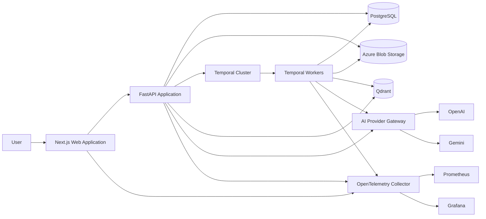
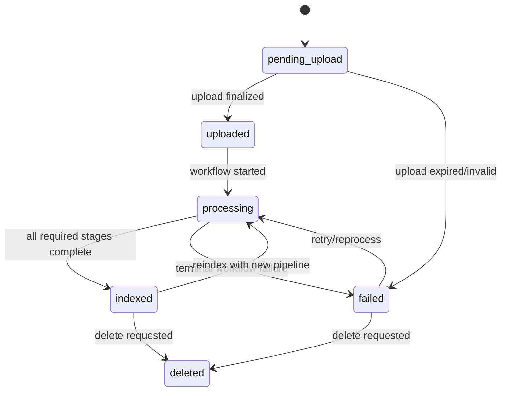
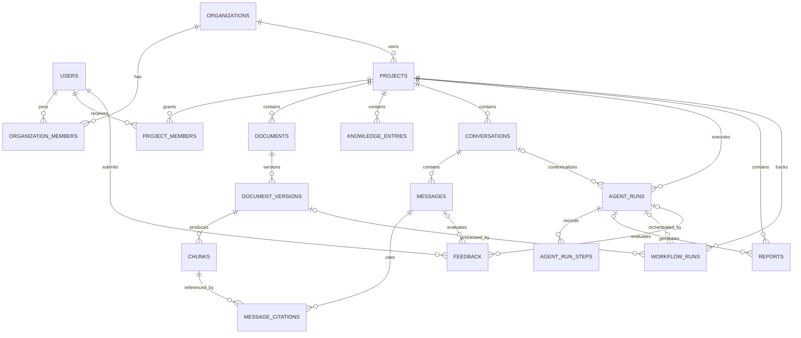
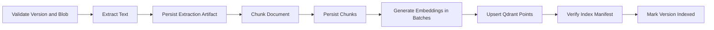

# AI Knowledge Operating System

## Production Architecture and Technical Specification

**Status:** Approved architecture; implementation in progress  
**Version:** 1.0  
**Date:** 2026-06-06  
**Implementation status:** Auth, personal tenancy bootstrap, Projects, PostgreSQL models, Alembic, FastAPI routes, and focused tests are implemented. All other domains remain planned.

---

## 0. Executive Decisions

This system will begin as a **modular monolith with separately deployable API, Temporal worker, and web application processes**. It will not begin as a collection of microservices.

This is a deliberate decision:

- The product domains require strong boundaries, but not independent scaling or deployment on day one.
- A modular monolith reduces distributed-system failure modes and accelerates iteration.
- Temporal workers, the API, and frontend already provide the required process-level scaling boundaries.
- Domain modules communicate through application interfaces and durable events, allowing selected domains to be extracted later without redesigning business logic.

The system will be **multi-tenant from inception**. A personal account receives a single-user organization. Enterprise accounts can add members later. Every tenant-owned database row, blob path, Qdrant point, workflow, trace, and cache key is scoped by `organization_id`.

The system of record is PostgreSQL:

- Azure Blob Storage stores immutable document binaries and generated report artifacts.
- Qdrant stores derived vector indexes, never authoritative business data.
- Temporal stores workflow execution history, while PostgreSQL stores product-facing workflow projections.
- PostgreSQL stores chunk text and metadata so vector indexes can be rebuilt.

The initial retrieval release supports vector search behind a stable retrieval pipeline. Hybrid search, reranking, and query rewriting are enabled later through strategies, not API-breaking rewrites.

---

# 1. System Architecture

## 1.1 Architectural Principles

1. **Domain ownership:** Each bounded context owns its business rules and persistence interfaces.
2. **Clean Architecture:** Domain logic has no dependency on FastAPI, SQLAlchemy, Temporal, Qdrant, Azure, or model vendors.
3. **Dependency inversion:** Infrastructure implements domain/application ports.
4. **Tenant isolation by construction:** Tenant scope is mandatory, not an optional query filter.
5. **Durable asynchronous work:** Long-running, retryable, or auditable operations use Temporal.
6. **Idempotency:** Every externally retried command and every Temporal activity is idempotent.
7. **Derived stores are rebuildable:** Qdrant indexes and projections can be recreated from PostgreSQL and Blob Storage.
8. **Provider independence:** AI behavior depends on internal model capabilities, not vendor SDK types.
9. **Explicit consistency:** Cross-resource operations document whether they are strongly or eventually consistent.
10. **Secure defaults:** Least privilege, encrypted secrets, scoped signed URLs, and ownership checks are baseline behavior.
11. **Observable boundaries:** Every request, workflow, activity, model call, retrieval, and storage call emits correlated telemetry.
12. **Evolution over speculation:** Introduce abstractions only at real variation points: providers, extraction, chunking, retrieval, reranking, and agent policies.

## 1.2 System Context



## 1.3 Runtime Components

| Component | Responsibility | Scaling model |
|---|---|---|
| Web application | UI, server rendering, browser session coordination | Horizontal, stateless |
| API application | Authentication, commands, queries, streaming chat, workflow initiation | Horizontal, stateless |
| Temporal ingestion worker | Document extraction, chunking, embedding, indexing | Horizontal by task queue |
| Temporal agent worker | Durable agent and report execution | Horizontal by task queue |
| PostgreSQL | Transactional source of truth and search metadata | Managed HA, read replicas later |
| Qdrant | Tenant/project-filtered vector retrieval | Replicated collection, sharded later |
| Blob Storage | Original documents, versions, generated artifacts | Managed object storage |
| AI provider gateway | Model selection, budgets, retries, telemetry, normalized errors | Library boundary initially |
| OpenTelemetry Collector | Receives and exports telemetry | Horizontal |

## 1.4 Deployment Topology

- Kubernetes namespaces: `knowledge-os-{environment}`.
- Deployments: `web`, `api`, `worker-ingestion`, `worker-agent`, `otel-collector`.
- Managed services preferred for PostgreSQL, Blob Storage, Qdrant, and Temporal.
- API and workers use separate service accounts and credentials.
- Worker task queues isolate noisy workloads:
  - `document-ingestion`
  - `embedding-generation`
  - `agent-execution`
  - `report-generation`
- Horizontal Pod Autoscaling signals:
  - API: request concurrency, p95 latency, CPU.
  - Workers: Temporal task queue backlog and schedule-to-start latency.
- Pod disruption budgets, readiness probes, liveness probes, topology spread constraints, and graceful termination are mandatory.

## 1.5 Trust Boundaries

- Browser is untrusted. It never receives provider secrets or broad storage credentials.
- API validates authentication, authorization, quotas, content type, size, and command idempotency.
- Workers trust only validated identifiers and re-check tenant ownership before data access.
- Signed Blob URLs are short-lived, operation-scoped, and issued only after authorization.
- Qdrant filters always include `organization_id`; project and document filters are additive.
- Cross-tenant resource lookup returns `404` to avoid resource enumeration.

## 1.6 Consistency Model

| Operation | Consistency |
|---|---|
| User registration, project CRUD, conversation/message persistence | Strong PostgreSQL transaction |
| Upload metadata and workflow start | Transactional outbox, eventually starts workflow |
| Blob upload completion to processing start | Eventual, idempotent |
| Document status and workflow progress | Eventual projection, typically seconds |
| Chunk persistence and Qdrant index | Eventual; document becomes `indexed` only after both succeed |
| Delete project/document | Immediate logical deletion; eventual purge from Blob/Qdrant |
| Streaming assistant response | Persisted incrementally/finalized transactionally; recoverable after disconnect |

---

# 2. Domain Architecture

## 2.1 Bounded Contexts

| Context | Owns | Does not own |
|---|---|---|
| Identity & Access | Users, credentials, sessions, refresh tokens, password reset | Project permissions |
| Tenancy | Organizations, memberships, tenant roles | Authentication credentials |
| Projects | Projects, project memberships/settings | Document internals |
| Documents | Document identity, versions, metadata, lifecycle | Extraction/index implementation |
| Knowledge | Chunks, indexing manifests, project knowledge entries | Search orchestration |
| Conversations | Conversations, messages, citations, context references | Model execution policy |
| Retrieval | Query planning, search, fusion, reranking, context building | Authoritative chunks |
| Agents | Agent definitions/policies, runs, steps, tool calls | Workflow durability |
| Reports | Report requests, sections, artifacts | Generic agent execution |
| Workflows | Product-facing run state and progress | Domain entity truth |
| Feedback | Ratings and qualitative feedback | Conversation ownership |

## 2.2 Aggregates and Invariants

### Identity & Access

- `User` aggregate:
  - Email is normalized and globally unique.
  - Password hashes use Argon2id.
  - Disabled users cannot create sessions or refresh tokens.
- `RefreshSession` aggregate:
  - Refresh tokens are opaque, random, rotated on use, and stored only as hashes.
  - Token reuse revokes the token family.

### Tenancy and Projects

- `Organization` is the tenant root.
- A personal workspace is an organization with one owner.
- `Project` belongs to exactly one organization.
- Project roles: `owner`, `editor`, `viewer`.
- Only owners can delete projects or manage membership.
- Deletion is soft first and triggers an asynchronous purge workflow.

### Documents

- `Document` is the stable logical identity.
- `DocumentVersion` is immutable after upload finalization.
- Exactly one version may be current.
- A checksum can prevent duplicate versions within a document.
- Status is derived from the current version processing state.

Document version state machine:



### Conversations

- A conversation belongs to one project and organization.
- Messages are append-only except for controlled redaction and assistant stream finalization.
- Message ordering uses a monotonic per-conversation sequence number.
- Citations reference document version and chunk identities, preserving historical provenance.

### Agents and Reports

- An `AgentRun` captures immutable execution input plus mutable lifecycle state.
- Agent policies determine tools, model capability, budget, and output schema.
- A `Report` owns the durable requested artifact; a report-generation agent run is an implementation detail.

## 2.3 Application Use Cases

Commands mutate state and queries read state. Application handlers coordinate aggregates, authorization policies, repositories, unit of work, and events.

Representative commands:

- `RegisterUser`
- `CreateSession`
- `RefreshSession`
- `CreateProject`
- `UpdateProject`
- `DeleteProject`
- `InitiateDocumentUpload`
- `FinalizeDocumentUpload`
- `ReprocessDocumentVersion`
- `CreateConversation`
- `SubmitChatMessage`
- `StartAgentRun`
- `GenerateReport`
- `SubmitFeedback`

Representative queries:

- `ListProjects`
- `GetProject`
- `ListDocuments`
- `GetDocumentVersion`
- `ListConversations`
- `GetConversationMessages`
- `SearchProjectKnowledge`
- `GetAgentRun`
- `ListReports`
- `GetWorkflowProgress`

## 2.4 Domain Events

Events are written to an outbox in the same transaction as domain changes.

| Event | Consumers |
|---|---|
| `identity.user_registered.v1` | Tenancy bootstrap |
| `project.deleted.v1` | Purge workflow |
| `document.upload_finalized.v1` | Document ingestion workflow starter |
| `document.version_indexed.v1` | Search availability projection, notification |
| `document.version_failed.v1` | Notification, workflow projection |
| `conversation.user_message_submitted.v1` | Optional durable chat execution |
| `agent.run_requested.v1` | Agent workflow starter |
| `report.generation_requested.v1` | Report workflow starter |

Events contain identifiers and safe metadata, not document bodies, prompts, or secrets.

---

# 3. Database Design

## 3.1 Database Standards

- PostgreSQL 16+.
- UUIDv7 primary keys for sortable distributed identifiers.
- `timestamptz` in UTC.
- Tenant-owned tables include non-null `organization_id`.
- Soft-deletable records include `deleted_at`.
- Mutable records include `created_at`, `updated_at`, and optimistic-lock `version`.
- Flexible metadata uses `jsonb`, but fields used for relationships, authorization, or frequent filtering remain typed columns.
- Foreign keys are enforced. Large purge operations are asynchronous rather than relying on broad cascading deletes.
- Row-level security is defense in depth, enabled after application-level tenant filtering is verified.

## 3.2 Entity Relationship Diagram



## 3.3 Table Catalog

All tenant-owned rows include `organization_id`, timestamps, and indexes beginning with `organization_id` unless stated otherwise.

### Identity and tenancy

| Table | Key fields and constraints |
|---|---|
| `users` | `id`, unique normalized `email`, `display_name`, `password_hash`, `status`, `last_login_at` |
| `refresh_sessions` | `id`, `user_id`, `token_hash`, `family_id`, `expires_at`, `revoked_at`, device/IP metadata |
| `password_reset_tokens` | `id`, `user_id`, `token_hash`, `expires_at`, `used_at` |
| `organizations` | `id`, `name`, `slug`, `type`, `settings`, `deleted_at` |
| `organization_members` | `(organization_id, user_id)` unique, `role`, `status` |

### Projects and documents

| Table | Key fields and constraints |
|---|---|
| `projects` | `id`, `organization_id`, `name`, `description`, `settings`, `created_by`, `deleted_at` |
| `project_members` | `(project_id, user_id)` unique, `organization_id`, `role` |
| `documents` | `id`, `project_id`, `name`, `current_version_id`, `created_by`, `deleted_at` |
| `document_versions` | `id`, `document_id`, `version_number`, `status`, `blob_uri`, `source_filename`, `mime_type`, `size_bytes`, `sha256`, `pipeline_version`, `failure_code`, `failure_detail`; unique `(document_id, version_number)` |
| `chunks` | `id`, `document_version_id`, `project_id`, `ordinal`, `content`, `content_sha256`, `token_count`, `page_start`, `page_end`, `section_path`, `metadata`, `embedding_model`, `embedding_version`; unique `(document_version_id, ordinal)` |
| `knowledge_entries` | Project-managed notes or curated knowledge: `id`, `project_id`, `title`, `content`, `status`, `created_by`, `metadata` |
| `index_manifests` | `id`, `document_version_id`, `collection_name`, `point_count`, `embedding_model`, `pipeline_version`, `indexed_at` |

`chunks` stores source text in PostgreSQL. Qdrant points use `chunk_id` as the point identifier and payload fields for `organization_id`, `project_id`, `document_id`, and `document_version_id`.

### Conversations

| Table | Key fields and constraints |
|---|---|
| `conversations` | `id`, `project_id`, `title`, `created_by`, `last_message_at`, `summary`, `summary_through_sequence`, `archived_at` |
| `messages` | `id`, `conversation_id`, `sequence`, `role`, `status`, `content`, `content_parts`, `model`, `prompt_tokens`, `completion_tokens`, `latency_ms`, `error_code`; unique `(conversation_id, sequence)` |
| `message_citations` | `id`, `message_id`, `chunk_id`, `document_version_id`, `quote`, `relevance_score`, `ordinal` |

Message statuses: `pending`, `streaming`, `completed`, `failed`, `cancelled`.

### Agents, reports, feedback, and workflows

| Table | Key fields and constraints |
|---|---|
| `agent_runs` | `id`, `project_id`, optional `conversation_id`, `agent_type`, `status`, `input`, `output`, `model_policy`, `budget`, `usage`, `started_at`, `completed_at`, `error_code` |
| `agent_run_steps` | `id`, `agent_run_id`, `sequence`, `step_type`, `status`, sanitized `input`, sanitized `output`, `started_at`, `completed_at` |
| `reports` | `id`, `project_id`, optional `agent_run_id`, `title`, `report_type`, `status`, `parameters`, `content`, `artifact_blob_uri`, `created_by` |
| `feedback` | `id`, `user_id`, optional `message_id`, optional `agent_run_id`, `rating`, `category`, `comment`; check exactly one target is set |
| `workflow_runs` | `id`, `project_id`, `workflow_type`, `temporal_workflow_id`, `temporal_run_id`, `status`, `progress_percent`, `current_stage`, `attempt`, `started_at`, `completed_at`, `error_code`, `error_detail`; unique `temporal_workflow_id` |
| `outbox_events` | `id`, `aggregate_type`, `aggregate_id`, `event_type`, `payload`, `occurred_at`, `published_at`, `attempts` |
| `idempotency_keys` | `organization_id`, `key`, `request_hash`, `response_status`, `response_body`, `expires_at`; unique `(organization_id, key)` |
| `audit_events` | `id`, `organization_id`, `actor_user_id`, `action`, `resource_type`, `resource_id`, `metadata`, `occurred_at` |

## 3.4 Critical Indexes

- `projects (organization_id, updated_at desc) where deleted_at is null`
- `documents (organization_id, project_id, updated_at desc) where deleted_at is null`
- `document_versions (organization_id, status, created_at)`
- `chunks (organization_id, project_id, document_version_id, ordinal)`
- PostgreSQL full-text index on `chunks.content` added for hybrid search phase.
- `conversations (organization_id, project_id, last_message_at desc)`
- `messages (organization_id, conversation_id, sequence)`
- `agent_runs (organization_id, project_id, created_at desc)`
- `workflow_runs (organization_id, project_id, status, created_at desc)`
- `outbox_events (published_at, occurred_at) where published_at is null`

## 3.5 Migration Strategy

- Alembic is the only schema migration mechanism.
- Migrations are forward-only in production; rollback is a new corrective migration.
- Use expand/migrate/contract for incompatible changes:
  1. Add nullable/new structures.
  2. Deploy dual-read/write compatibility.
  3. Backfill in controlled batches.
  4. Enforce constraints.
  5. Remove legacy fields in a later release.
- Migrations must not perform unbounded table rewrites or large data backfills.
- CI creates a fresh database, runs all migrations, validates model/schema parity, and tests upgrade from the previous release.
- Qdrant schema/index changes use versioned collections and alias swaps.

## 3.6 SQLAlchemy Model Contract

SQLAlchemy models are an infrastructure concern and will be generated during implementation, after this specification is approved. They must follow these rules:

- SQLAlchemy 2.x typed declarative mappings and async sessions only.
- Separate domain entities from ORM models; repositories map between them.
- Shared mixins: UUIDv7 identity, timestamps, optimistic version, tenant scope, and soft deletion where applicable.
- Python enums map to named PostgreSQL enums only for stable lifecycle states; rapidly evolving classifications use validated strings.
- Relationships default to explicit loading. Lazy I/O from domain or serialization code is prohibited.
- Repository methods require a tenant context and apply organization scope internally.
- Database constraints mirror aggregate invariants where possible.
- Transactions are controlled by an application-layer unit of work, not committed inside repositories.
- ORM models are never returned directly from API endpoints.
- Alembic autogeneration is reviewed manually; generated migrations are not accepted blindly.

---

# 4. API Contracts

## 4.1 API Standards

- Base path: `/api/v1`.
- JSON uses `snake_case`.
- IDs are UUID strings.
- Cursor pagination: `?cursor=&limit=`; maximum limit enforced.
- Mutating retryable requests require `Idempotency-Key`.
- Errors use RFC 9457 Problem Details with `type`, `title`, `status`, `detail`, `instance`, `error_code`, `correlation_id`, and safe field errors.
- Authentication uses short-lived access JWTs and rotated opaque refresh tokens.
- Access JWTs contain user/session identity, not mutable authorization grants.
- Authorization is resolved server-side from tenant and project membership.
- OpenAPI is the contract source of truth; generated TypeScript clients are used by the frontend.

## 4.2 Authentication and Tenancy

| Method | Path | Purpose |
|---|---|---|
| `POST` | `/auth/register` | Register user and personal organization |
| `POST` | `/auth/login` | Create access and refresh session |
| `POST` | `/auth/refresh` | Rotate refresh token |
| `POST` | `/auth/logout` | Revoke session |
| `POST` | `/auth/password-reset/request` | Request reset without revealing account existence |
| `POST` | `/auth/password-reset/confirm` | Consume reset token |
| `GET` | `/me` | Current user and accessible organizations |

## 4.3 Projects and Documents

| Method | Path | Purpose |
|---|---|---|
| `GET/POST` | `/projects` | List/create projects |
| `GET/PATCH/DELETE` | `/projects/{project_id}` | Read/update/delete project |
| `GET/POST` | `/projects/{project_id}/documents` | List/initiate document upload |
| `POST` | `/projects/{project_id}/documents/{document_id}/versions` | Initiate new version upload |
| `POST` | `/document-versions/{version_id}/finalize` | Validate uploaded blob and start ingestion |
| `POST` | `/document-versions/{version_id}/reprocess` | Start a new processing attempt |
| `GET` | `/document-versions/{version_id}` | Version status and metadata |
| `DELETE` | `/documents/{document_id}` | Logical delete and purge |

Upload protocol:

1. Client initiates upload with filename, type, and size.
2. API validates quota/type and returns a scoped signed upload URL plus version ID.
3. Client uploads directly to Blob Storage.
4. Client finalizes upload.
5. API verifies blob properties/checksum, records `uploaded`, and emits the ingestion event.

This avoids proxying large files through API pods.

## 4.4 Conversations and Search

| Method | Path | Purpose |
|---|---|---|
| `GET/POST` | `/projects/{project_id}/conversations` | List/create conversations |
| `GET/PATCH/DELETE` | `/conversations/{conversation_id}` | Read/update/archive conversation |
| `GET` | `/conversations/{conversation_id}/messages` | Paginated history |
| `POST` | `/conversations/{conversation_id}/messages` | Submit user message and stream response |
| `POST` | `/projects/{project_id}/search` | Search project knowledge |

Chat streaming uses Server-Sent Events:

- `message.accepted`
- `retrieval.started`
- `retrieval.completed`
- `response.delta`
- `citation`
- `response.completed`
- `response.failed`

SSE is selected over WebSockets for the initial one-way streaming requirement. It is simpler to operate through proxies and supports reconnection. The endpoint accepts `Last-Event-ID` for resumable delivery where retained.

## 4.5 Agents, Reports, and Workflows

| Method | Path | Purpose |
|---|---|---|
| `GET` | `/agents` | Available agent capabilities and policies |
| `POST/GET` | `/projects/{project_id}/agent-runs` | Start/list agent runs |
| `GET/POST` | `/agent-runs/{run_id}` / `/agent-runs/{run_id}/cancel` | Inspect/cancel run |
| `GET/POST` | `/projects/{project_id}/reports` | List/request reports |
| `GET` | `/reports/{report_id}` | Report status/content |
| `GET` | `/reports/{report_id}/download` | Short-lived artifact URL |
| `GET` | `/projects/{project_id}/workflow-runs` | Workflow monitor list |
| `GET` | `/workflow-runs/{run_id}` | Workflow progress |

## 4.6 Authorization Matrix

| Capability | Viewer | Editor | Owner |
|---|---:|---:|---:|
| Read project/documents/conversations/reports | Yes | Yes | Yes |
| Search/chat/run agents/generate reports | Configurable | Yes | Yes |
| Upload/update documents and project knowledge | No | Yes | Yes |
| Update project settings | No | No | Yes |
| Delete project/manage members | No | No | Yes |

---

# 5. Frontend Architecture

## 5.1 Routing Structure

```text
app/
  (auth)/
    login/
    register/
    forgot-password/
    reset-password/
  (product)/
    layout
    dashboard/
    projects/[projectId]/
      overview/
      documents/
      documents/[documentId]/
      chat/
      conversations/[conversationId]/
      agents/
      agents/runs/[runId]/
      reports/
      reports/[reportId]/
      workflows/
      settings/
    settings/
      profile/
      security/
```

## 5.2 Component Hierarchy

```text
RootLayout
  Providers
    AuthSessionProvider
    QueryClientProvider
    TelemetryProvider
  ProductShell
    OrganizationSwitcher
    ProjectSidebar
    GlobalCommandMenu
    PageHeader
    RouteContent
      Dashboard
      ProjectOverview
      DocumentExplorer
      ChatWorkspace
      AgentCenter
      ReportWorkspace
      WorkflowMonitor
      Settings
```

Feature-level components:

- `DocumentExplorer`: upload dropzone, document table, version drawer, processing status.
- `ChatWorkspace`: conversation list, message timeline, composer, citation panel, stream status.
- `AgentCenter`: agent catalog, run form, run timeline, output viewer.
- `WorkflowMonitor`: filterable run table, progress timeline, failure detail.
- `ReportWorkspace`: report request form, report viewer, export/download.

## 5.3 State Management Strategy

| State type | Owner |
|---|---|
| Server resources, caching, pagination, invalidation | TanStack Query |
| Route identity, filters worth sharing/bookmarking | URL search params |
| Small cross-component UI state | Zustand |
| Form state and validation | React Hook Form + schema validation |
| Authentication tokens | Secure `HttpOnly`, `Secure`, `SameSite` cookies |
| Streaming response state | Feature-local reducer merged into TanStack cache on completion |

Zustand must not duplicate server state. Stores are limited to UI preferences, sidebar state, active panels, and unsent drafts.

## 5.4 API Integration Layer

- Generate TypeScript request/response types and client methods from FastAPI OpenAPI.
- Wrap generated methods in feature-specific TanStack Query hooks.
- Centralize correlation IDs, Problem Details parsing, refresh behavior, and abort signals.
- No raw `fetch` calls inside feature components.
- Mutations use idempotency keys and invalidate narrowly scoped query keys.
- SSE has a dedicated typed client with cancellation and reconnect behavior.

## 5.5 Frontend Quality Requirements

- Next.js Server Components by default; Client Components only for interaction and streaming.
- Accessibility target: WCAG 2.2 AA.
- Virtualize large message/document lists.
- Loading, empty, error, unauthorized, and partial-progress states are designed for every page.
- Error boundaries exist at root and feature boundaries.
- Browser telemetry excludes document content and prompts by default.

---

# 6. Temporal Workflow Design

## 6.1 Workflow Rules

- Workflow code is deterministic and performs orchestration only.
- I/O and nondeterministic work occur in activities.
- Activity inputs carry IDs and immutable parameters, not large document content.
- Every activity is idempotent and records its output checkpoint.
- Workflow IDs are deterministic:
  - `document-ingestion:{version_id}:{pipeline_version}`
  - `agent-run:{agent_run_id}`
  - `report-generation:{report_id}`
- Workflow evolution uses Temporal versioning/worker deployment controls.
- Product-facing progress is projected to `workflow_runs`.

## 6.2 Document Ingestion Workflow



Activities:

1. `validate_document_version`
2. `extract_document_text`
3. `persist_extraction_artifact`
4. `chunk_document`
5. `persist_chunks`
6. `generate_embedding_batch`
7. `upsert_vector_batch`
8. `verify_index_manifest`
9. `mark_document_indexed`

Partial failure behavior:

- Extraction and chunking artifacts are versioned and checkpointed.
- Embedding/index activities process deterministic batches and can retry independently.
- Qdrant upserts use deterministic `chunk_id`, making repeats safe.
- A terminal failure marks the version `failed` with a safe error code; completed stage outputs remain reusable.
- Reprocessing with the same pipeline resumes incomplete work. A new pipeline version creates a new manifest and reindexes.

Retry policy:

- Retry transient network, provider throttling, and dependency unavailability with exponential backoff and jitter.
- Do not retry unsupported format, malware detection, invalid file, quota violation, or authorization failures.
- Apply per-activity timeouts and heartbeat long extraction/index operations.

## 6.3 Agent Execution Workflow

1. Validate run and capture immutable policy.
2. Build execution context.
3. Execute the selected agent policy through a common orchestration workflow.
4. Persist steps/tool calls and progress.
5. Validate structured output.
6. Finalize run or record terminal failure.

Agents differ by prompt policy, available tools, model requirements, budget, and output schema. They do not require separate orchestration engines.

## 6.4 Report Generation Workflow

1. Validate request and source scope.
2. Run research/retrieval plan.
3. Generate report sections with checkpoints.
4. Validate citations and report schema.
5. Assemble final content.
6. Render/export artifact.
7. Persist artifact URI and finalize report.

## 6.5 Progress and Cancellation

- Activities emit heartbeat details and progress events.
- Workflow queries expose detailed current state.
- Cancellation is cooperative. Activities check cancellation between batches.
- User-facing progress is stage-based and must not claim false numeric precision.

---

# 7. Agent and Retrieval Architecture

## 7.1 Provider Gateway

PydanticAI is used for agent modeling and structured output, but domain/application layers depend on internal ports:

- `ModelGateway`: streaming and non-streaming generation.
- `EmbeddingGateway`: batch embeddings.
- `ToolRegistry`: authorized tools available for a run.
- `ModelPolicyResolver`: selects provider/model using capability, tenant policy, latency, and budget.
- `UsageRecorder`: normalized token/cost/latency accounting.

Provider routing must not silently switch providers when this changes data residency or model behavior. Fallbacks are policy-controlled and observable.

## 7.2 Agent Catalog

| Agent | Purpose | Default tools | Output |
|---|---|---|---|
| Chat | Answer within project context | Retrieval, conversation context | Streamed answer with citations |
| Summary | Summarize selected knowledge | Retrieval | Structured summary |
| Research | Investigate a question across project knowledge | Retrieval, iterative planning | Findings with evidence |
| Comparison | Compare selected documents/entities | Retrieval | Comparison matrix and narrative |
| Compliance | Evaluate against configured rules | Retrieval, rule catalog | Findings with severity/evidence |
| Report | Produce durable report artifact | Retrieval, section writer, renderer | Structured report |

Agent runs have explicit maximum duration, model spend, tool calls, retrieval calls, and context tokens.

## 7.3 Retrieval Pipeline

Stable pipeline:

```text
Query
  -> authorization scope
  -> optional query rewrite
  -> candidate retrieval strategies
  -> result fusion
  -> optional reranking
  -> diversity/deduplication
  -> token-budgeted context builder
  -> citations and diagnostics
```

Phases:

| Phase | Capability | Design |
|---|---|---|
| 1 | Vector search | Qdrant similarity with mandatory tenant/project filters |
| 2 | Hybrid search | Qdrant vector + PostgreSQL full-text candidates, reciprocal rank fusion |
| 3 | Reranking | Provider-independent reranker port over top candidates |
| 4 | Query rewriting | Guarded rewrite/multi-query strategy preserving original query |

## 7.4 Context Building

- Respect model token budget and reserve response capacity.
- Prefer relevant, diverse chunks; avoid adjacent duplicate content unless needed.
- Include document/version/page/section provenance.
- Treat retrieved text as untrusted data, not instructions.
- Use conversation summary plus recent message window; never send unlimited history.
- Record retrieval diagnostics without storing sensitive prompt bodies in telemetry.

## 7.5 Evaluation

Before enabling a retrieval phase or model policy in production:

- Maintain a versioned evaluation dataset with questions, expected evidence, and answer criteria.
- Track recall@k, MRR/NDCG where applicable, citation precision, groundedness, answer quality, latency, and cost.
- Run offline regression gates and online feedback analysis.
- Store pipeline/model/prompt versions with every run.

---

# 8. Folder Structure

The repository is a monorepo. Domain modules live inside the backend but expose explicit public interfaces.

```text
/
  docs/
    technical-specification.md
    adr/
    api/
    operations/
  backend/
    pyproject.toml
    alembic.ini
    migrations/
    src/knowledge_os/
      bootstrap/
      api/
        v1/
        dependencies/
        middleware/
        schemas/
      domains/
        identity/
          domain/
          application/
          infrastructure/
        tenancy/
        projects/
        documents/
        knowledge/
        conversations/
        retrieval/
        agents/
        reports/
        workflows/
        feedback/
      shared/
        domain/
        application/
        infrastructure/
      infrastructure/
        database/
        blob/
        qdrant/
        ai/
        telemetry/
        security/
        events/
      temporal/
        workflows/
        activities/
        workers/
    tests/
      unit/
      integration/
      contract/
      architecture/
      e2e/
  frontend/
    app/
    features/
    components/
      ui/
    lib/
      api/
      auth/
      telemetry/
    stores/
    tests/
  deploy/
    docker/
    helm/
    observability/
  scripts/
```

Dependency rules:

- `domain` imports only standard library and domain-safe primitives.
- `application` imports its domain and shared application abstractions.
- `infrastructure` implements application ports.
- `api` and `temporal` are delivery mechanisms that call application use cases.
- Cross-domain calls use application interfaces or events, never another domain's repositories.
- Architecture tests enforce forbidden imports.

---

# 9. Development Roadmap

## Phase 0: Architecture and Engineering Foundation

- Approve specification and architecture decision records.
- Bootstrap monorepo, quality gates, local infrastructure, CI, observability, and deployment skeleton.
- Define OpenAPI, error, security, tenancy, and telemetry standards.

Exit gate: deployable empty vertical slice with health/readiness, migrations, traces, and CI.

## Phase 1: Secure Knowledge Foundation

- Identity, tenancy, projects.
- Direct-to-Blob document upload and versioning.
- Durable ingestion workflow.
- Vector indexing and document/workflow status.

Exit gate: authorized user can upload a supported document and reliably reach `indexed`.

## Phase 2: Conversational RAG

- Conversations and messages.
- Vector retrieval and context builder.
- PydanticAI chat agent, SSE streaming, citations.
- Persistence and resume behavior.

Exit gate: user can resume a conversation and receive grounded, cited answers.

## Phase 3: Knowledge Operations

- Search UI/API.
- Project knowledge entries.
- Hybrid search and reranking behind evaluation gates.
- Feedback and retrieval diagnostics.

Exit gate: measured retrieval improvement with no unacceptable latency/cost regression.

## Phase 4: Agents and Reports

- Durable agent execution, catalog, budgets, cancellation.
- Summary, research, comparison, compliance, and report policies.
- Report generation and artifacts.

Exit gate: agents and reports are auditable, bounded, cancellable, and recover after worker restart.

## Phase 5: Enterprise Readiness

- Organization/member administration, quotas, audit views, retention policies.
- Scale tests, disaster recovery, security review, SLOs, runbooks.

Exit gate: production readiness review passes.

---

# 10. Sprint Plan

Assumption: two-week sprints, one cross-functional product team. Sprint scope must be adjusted to actual staffing.

| Sprint | Goal | Primary deliverables | Exit criteria |
|---|---|---|---|
| 0 | Architecture approval | Spec review, ADRs, threat model, initial API schemas | Decisions approved; open questions resolved |
| 1 | Engineering foundation | Monorepo, CI, lint/type/test gates, Docker/K8s skeleton, telemetry | All services deploy and emit correlated health telemetry |
| 2 | Identity and tenancy | Registration, login, refresh rotation, personal org, authorization policies | Security tests and tenant isolation tests pass |
| 3 | Projects and upload | Project CRUD, direct Blob upload, document/version metadata | Authorized upload finalization works; quotas enforced |
| 4 | Durable ingestion | Temporal workflow, extraction, chunking, progress, retries | Restart/retry and terminal failure tests pass |
| 5 | Vector knowledge | Embeddings, Qdrant indexing, vector retrieval, manifests | Index rebuild and tenant filter tests pass |
| 6 | Conversation persistence | Conversation/message APIs and chat workspace shell | History pagination and resume behavior pass |
| 7 | Streaming RAG chat | Context builder, chat agent, SSE, citations | Grounded streaming answer persists after completion/failure |
| 8 | Search and knowledge | Search UI/API, curated knowledge entries, feedback | Search quality baseline established |
| 9 | Hybrid and reranking | Full-text candidates, fusion, reranker, evaluation harness | Evaluation gate demonstrates approved improvement |
| 10 | Durable agents | Agent catalog, workflow, budgets, cancellation, agent center | Agent recovery/cancellation/audit tests pass |
| 11 | Reports | Report workflow, viewer, artifact export | Report generation is resumable and cited |
| 12 | Production readiness | Load/security/DR tests, SLOs, runbooks, retention | Readiness review passes |

Every sprint includes:

- Unit, integration, contract, architecture, and targeted end-to-end tests.
- Threat-model delta and observability review.
- Migration and rollback/roll-forward review.
- API and user documentation updates.

---

# 11. Risks and Tradeoffs

| Risk / decision | Impact | Mitigation / justification |
|---|---|---|
| Starting with microservices | Excess operational complexity and slow domain iteration | Use modular monolith plus separately scalable workers; extract only with measured need |
| Omitting organization tenancy | Expensive and risky enterprise retrofit | Personal organizations from day one |
| JWT authorization claims becoming stale | Unauthorized access after role changes | JWT carries identity only; resolve permissions server-side |
| Qdrant treated as source of truth | Irrecoverable drift and deletion complexity | PostgreSQL chunks/manifests are authoritative; indexes rebuildable |
| Dual-write to DB and Temporal/Qdrant | Inconsistent states | Transactional outbox, idempotent activities, verification manifests |
| Long chat request interrupted | Lost response or inconsistent history | Persist message lifecycle, support cancellation/recovery, durable workflow for long agent tasks |
| Provider lock-in | Cost and availability exposure | Internal capability-based gateways and normalized telemetry |
| Prompt injection from documents | Unsafe agent/tool actions | Treat context as data, tool allowlists, strict schemas, authorization per tool call |
| Sensitive data in logs/traces | Security/privacy incident | Default redaction, metadata-only telemetry, controlled debug access |
| Unbounded agent cost | Financial and latency risk | Per-run budgets, timeouts, tool limits, tenant quotas, cost telemetry |
| Unsupported/hostile files | Processing compromise | Type/size validation, malware scanning, sandboxed extraction, decompression limits |
| Hybrid/reranking complexity too early | Slower launch without proven value | Ship vector baseline and require evaluation gates |
| PostgreSQL chunk growth | Storage and query pressure | Partition/archival strategy when measured; retain typed indexes and lifecycle policies |
| Temporal history growth | Workflow performance issues | Child workflows/continue-as-new for high-step runs; bounded event detail |

## 11.1 Initial SLO Targets

Targets must be validated under representative load before becoming commitments.

- API availability: 99.9% monthly.
- Read API p95 latency: under 300 ms excluding external model calls.
- Chat first-token p95: under 3 seconds when provider is healthy.
- Workflow start p95 after upload finalization: under 10 seconds.
- Indexed-document success rate: at least 99% for supported valid formats.
- Zero cross-tenant data exposure.

## 11.2 Security Requirements

- Argon2id password hashing and breached-password controls.
- Refresh-token rotation/reuse detection; short-lived access tokens.
- Rate limits on authentication, uploads, chat, agents, and report generation.
- Encryption in transit and at rest; secrets from a managed secret store.
- Malware scanning and sandboxed extraction before content processing.
- Authorization checks at API, application policy, repository scope, Blob issuance, Qdrant filter, and tool invocation boundaries.
- Audit events for authentication, membership, project deletion, document access/deletion, agent execution, and report download.
- Dependency, container, SAST, and IaC scanning in CI.

## 11.3 Observability Requirements

All telemetry includes safe correlation attributes:

- `correlation_id`
- `organization_id`
- `project_id` when applicable
- `user_id` when permitted
- `workflow_id` / `workflow_run_id`
- `agent_run_id`
- `document_version_id`
- provider/model/pipeline versions

Metrics:

- Request rate, error rate, and latency.
- Active streams and disconnects.
- Workflow queue latency, activity latency/retries/failures.
- Ingestion stage latency and failure reasons.
- Retrieval latency, result counts, and quality metrics.
- Model latency, token usage, cost, throttles, and failures.
- Qdrant/PostgreSQL/Blob dependency health.

Logs are structured and redacted. Traces span browser/API where appropriate, workflow/activity boundaries, retrieval, storage, and provider calls.

---

# 12. Approval Gates and Open Decisions

Implementation must not begin until the following are approved:

1. Modular monolith and separately deployed worker topology.
2. Organization as mandatory tenant boundary.
3. Personal organization bootstrap behavior.
4. Supported initial document formats and maximum file size.
5. Data retention, deletion, and backup requirements.
6. Default AI provider/model policies and permitted fallback behavior.
7. Whether chat execution remains request-scoped initially or uses Temporal from the first release.
8. Target compliance posture and data residency constraints.
9. Initial product quotas and cost budgets.
10. Initial SLOs and supported scale assumptions.

Recommended defaults:

- Initial formats: PDF, DOCX, TXT, Markdown; defer OCR-heavy image documents until the extraction quality bar is defined.
- Initial upload limit: 100 MB, configurable per tenant.
- Chat: request-scoped SSE for ordinary chat; Temporal for explicit agents and reports. Promote chat to durable execution only if disconnect recovery requirements justify the added latency/complexity.
- Retrieval: vector search first, with evaluation instrumentation included from the beginning.
- Deployment: managed PostgreSQL, Blob Storage, Qdrant, and Temporal where available.

---

# 13. Definition of Production-Grade Completion

A feature is complete only when:

- Domain invariants and authorization rules are explicit and tested.
- API contract and generated client are updated.
- Tenant isolation tests cover positive and negative cases.
- Idempotency and retry behavior are tested.
- Failure, cancellation, and partial-progress UX exists.
- Traces, metrics, logs, alerts, and a runbook exist.
- Schema changes follow the migration strategy.
- Security and privacy review passes.
- Load and cost impact is measured where applicable.
- Documentation and relevant ADRs are current.
